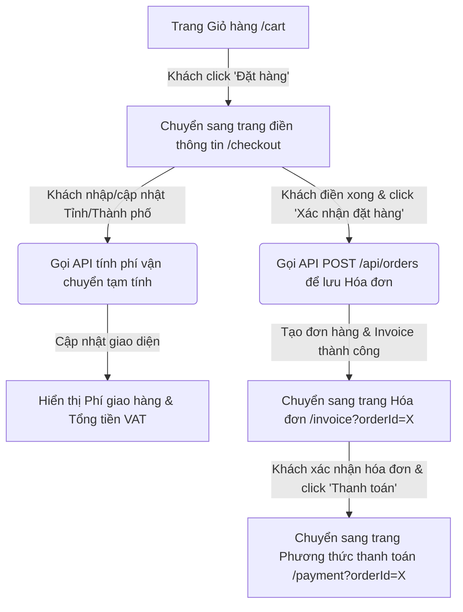

# Kế hoạch triển khai (Code Plan): Use Case Đặt hàng (Place Order)

Tài liệu này chi tiết hóa các bước triển khai kỹ thuật cho Use Case Đặt hàng (Place Order) để đảm bảo tuân thủ nghiêm ngặt luồng nghiệp vụ được đặc tả trong Problem Statement.

---

## Sơ đồ luồng đặt hàng (Đặt hàng -> Hóa đơn -> Thanh toán)



---

## Chi tiết các bước triển khai

### Step 1: Chuyển từ Giỏ hàng sang trang Thông tin giao hàng
- **Frontend (`CartComponent` -> `CheckoutComponent`)**:
  - Tại trang Giỏ hàng (`CartComponent`), khi khách hàng nhấn nút **"Place Order"** (Đặt hàng) (nút này chỉ khả dụng khi giỏ hàng hợp lệ, không có sản phẩm nào bị cảnh báo lỗi tồn kho đỏ):
    - Frontend thực hiện điều hướng thẳng sang trang Checkout tại Route `/checkout`.
    - Dữ liệu giỏ hàng sẽ được truyền tiếp và sử dụng tại `CheckoutComponent` thông qua `CartService`.

### Step 2: Nhập thông tin giao hàng & Hiển thị thông tin giỏ hàng
- **Frontend (`CheckoutComponent` tại route `/checkout`)**:
  - Khách hàng điền thông tin giao hàng gồm:
    - Họ tên người nhận (`receiverName`) - bắt buộc.
    - Email (`email`) - bắt buộc, đúng định dạng.
    - Số điện thoại (`phoneNumber`) - bắt buộc, định dạng số điện thoại.
    - Địa chỉ cụ thể (`address`) - bắt buộc.
    - Tỉnh/Thành phố (`province`) - bắt buộc.
    - Ghi chú giao hàng (`deliveryNotes`) - không bắt buộc.
  - Đồng thời, khách hàng vẫn nhìn thấy danh sách sản phẩm và thông tin giỏ hàng ở bên cạnh để đối chiếu.

---

### Step 3: Tính toán phí vận chuyển tự động khi nhập địa chỉ
- **Backend (Bổ sung API mới trong `OrderController`)**:
  - **Endpoint**: `POST /api/orders/shipping-fee`
  - **Payload**:
    ```json
    {
      "province": "Ha Noi",
      "cartItems": [
        { "productId": 1, "quantity": 2 }
      ]
    }
    ```
  - **Xử lý**:
    - Dựa vào danh sách sản phẩm để lấy thông tin khối lượng (`weight`) và giá cả.
    - Tính tổng trọng lượng và tổng giá trị đơn hàng chưa VAT (`subtotal`).
    - Gọi `ShippingCalculatorService.calculateShippingFee(province, totalWeight, subtotal)` để tính phí vận chuyển.
      - **Quy tắc giảm phí**: Nếu tổng giá trị đơn hàng (`subtotal`) lớn hơn 100,000 VND, phí vận chuyển sẽ được giảm trừ tối đa 25,000 VND.
    - Trả về số tiền phí giao hàng (`shippingFee`).

- **Frontend**:
  - Mỗi khi khách hàng thay đổi hoặc nhập thông tin vào trường **Địa chỉ cụ thể (`address`)** hoặc **Tỉnh/Thành phố (`province`)**, Frontend sẽ tự động kích hoạt cuộc gọi API đến `POST /api/orders/shipping-fee` để tính toán lại phí ship dựa trên dữ liệu địa lý mới.
  - Khi có kết quả phí ship từ Backend, hiển thị lập tức lên giao diện và tính toán lại Tổng thanh toán:
    $$\text{Tổng thanh toán} = \text{Tổng tiền hàng chưa VAT} + \text{Thuế VAT (10\%)} + \text{Phí giao hàng}$$

---

### Step 4: Xác nhận thông tin giao hàng & Tạo Hóa đơn (Invoice)
- **Frontend**:
  - Khi khách hàng nhấn nút **"Xác nhận đặt hàng"**:
    - Frontend thực hiện validate form thông tin giao hàng.
    - Nếu hợp lệ, gửi toàn bộ giỏ hàng và thông tin giao hàng lên API backend: `POST /api/orders`.

- **Backend (`OrderService.placeOrder`)**:
  - Khởi chạy một database transaction:
    - Khóa các dòng sản phẩm (`pessimistic_write`) để tránh tranh chấp tồn kho.
    - Trừ kho sản phẩm thực tế.
    - Lưu các bảng dữ liệu: `Order`, `OrderItem`, `DeliveryInfo`, và lưu trữ thông tin hóa đơn (`Invoice`) tạm thời.
    - Trả về đối tượng Đơn hàng chứa thông tin hóa đơn tạm thời và `orderID` vừa được sinh ra.

---

### Step 5: Hiển thị Hóa đơn (Display Invoice)
- **Frontend (`InvoiceComponent` tại route `/invoice?orderId=X` - Tạo mới)**:
  - Nhận phản hồi đặt hàng thành công và điều hướng sang `/invoice?orderId=X`.
  - **Mục đích**: Chỉ hiển thị thông tin hóa đơn chi tiết để khách hàng xác nhận lại, **không** chứa các nút chọn phương thức thanh toán.
  - **Thông tin hiển thị**:
    - Danh sách sản phẩm trong giỏ hàng (tên, số lượng, đơn giá, thành tiền).
    - Tổng tiền hàng chưa thuế (`subTotal` - tiền hàng gốc).
    - Tổng tiền hàng đã bao gồm VAT 10% (`subTotal + tax`).
    - Phí vận chuyển (`shippingFee`).
    - Tổng tiền cần thanh toán thực tế (`totalPayment` = tiền hàng sau thuế + phí vận chuyển).
  - Có nút **"Tiến hành thanh toán"** để xác nhận hóa đơn và đi tiếp.

---


